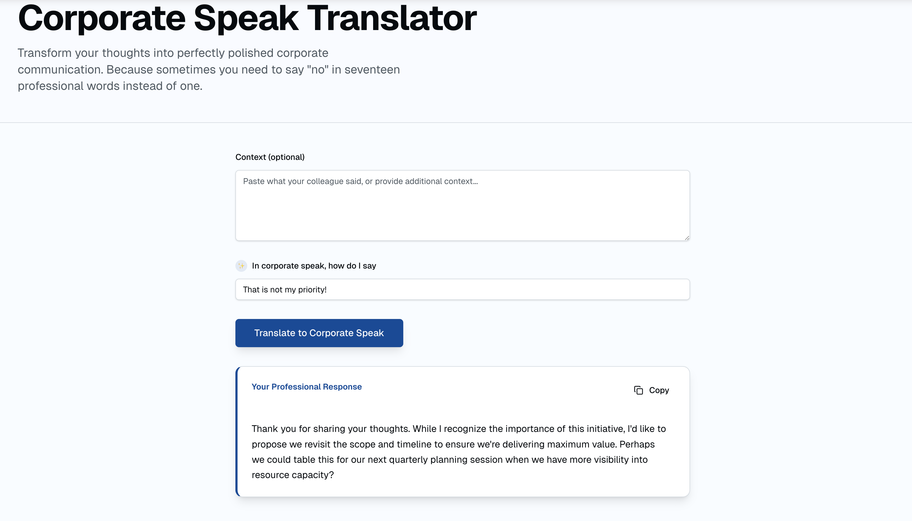

# Corporate Speak Translator

Transform your thoughts into perfectly polished corporate communication. Because sometimes you need to say "no" in seventeen professional words instead of one.



## Overview

The Corporate Speak Translator is an AI-powered web application that helps you convert casual phrases into professional corporate language. Whether you need to politely decline a request, provide strategic feedback, or communicate complex ideas, this tool helps you craft the perfect corporate response.

## Tech Stack

This project is built as a modern monorepo using the following technologies:

- **Frontend**: Next.js 16, React 19, TypeScript
- **Styling**: Tailwind CSS 4, Radix UI components
- **Backend**: AWS Lambda functions with AWS Bedrock (Amazon Nova Lite)
- **Infrastructure**: AWS CDK (API Gateway, Lambda)
- **Package Management**: pnpm workspace

## Project Structure

This is a **pnpm workspace** monorepo containing:

- `apps/web` - Next.js frontend application
- `infra` - AWS CDK infrastructure code with Lambda functions and API Gateway

## Installation

1. Clone the repository:

   ```bash
   git clone <repository-url>
   cd corporate-speak
   ```

2. Install dependencies:

   ```bash
   pnpm install
   ```

3. Start the development server:

   ```bash
   pnpm run web:dev
   ```

4. Open [http://localhost:3000](http://localhost:3000) in your browser

## Available Scripts

- `pnpm run web:dev` - Start the Next.js development server
- `pnpm run web:build` - Build the Next.js application for production
- `pnpm run web:start` - Start the production server
- `pnpm run web:lint` - Run ESLint
- `pnpm run infra:build` - Build the CDK infrastructure
- `pnpm run infra:deploy` - Deploy the CDK infrastructure

## Contributing

Contributions are welcome! Please feel free to submit a Pull Request. For major changes, please open an issue first to discuss what you would like to change.

## Viewing Starter Implementation

This repository is currently on the `main` branch, which contains the complete implementation with full infrastructure and backend integration. To view the starter implementation with mock data, please checkout the `starter` branch:

```bash
git checkout starter
```
