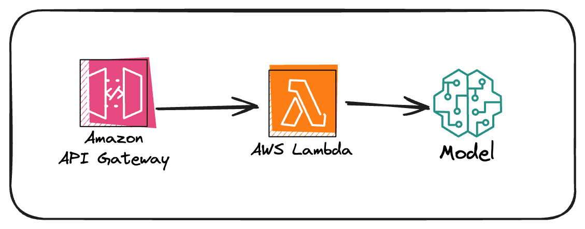

# Corporate Speak Translator - Infrastructure

This directory contains the AWS CDK infrastructure code for deploying the Corporate Speak Translator application.

## Architecture



The infrastructure consists of:

- **API Gateway (HTTP API)**: Provides a RESTful endpoint for the frontend to call
- **Lambda Function**: Processes translation requests using AWS Bedrock
- **AWS Bedrock**: Uses Amazon Nova Lite model to generate corporate responses
- **IAM Permissions**: Lambda has permissions to invoke Bedrock models

## Infrastructure Components

### API Gateway

The HTTP API is configured with:

- CORS enabled for `http://localhost:3000` (development)
- POST endpoint at `/generate-corporate-speak`
- Integration with the Lambda function

### Lambda Function

Located in `lib/functions/generate-corporate-speak.ts`, this function:

- Receives context and phrase from the API Gateway
- Constructs a conversation prompt for AWS Bedrock
- Uses Amazon Nova Lite (`amazon.nova-lite-v1:0`) model
- Returns the generated corporate response

The Lambda function has:

- Node.js 22 runtime
- 7-second timeout
- IAM permissions to invoke Bedrock models

### CDK Stack

The `CorporateSpeakStack` in `lib/infra-stack.ts` defines:

- HTTP API with CORS configuration
- Lambda function with Bedrock integration
- API Gateway route integration
- CloudFormation output for the API URL

## Deployment

### Prerequisites

1. AWS CLI configured with appropriate credentials
2. CDK CLI installed (`npm install -g aws-cdk`)
3. AWS account with Bedrock access enabled

### Deploy the Stack

```bash
pnpm run deploy
```

This will deploy the stack using the `focusotter-sandbox` AWS profile. To use a different profile, modify the deploy script in `package.json`.

### Build the Stack

```bash
pnpm run build
```

### View CloudFormation Template

```bash
npx cdk synth
```

### Compare with Deployed Stack

```bash
npx cdk diff
```

## Project Structure

```
infra/
├── bin/
│   └── infra.ts              # CDK app entry point
├── lib/
│   ├── infra-stack.ts        # Main CDK stack definition
│   └── functions/
│       └── generate-corporate-speak.ts  # Lambda function code
├── architecture.png          # Architecture diagram
├── cdk.json                  # CDK configuration
├── package.json              # Dependencies
└── tsconfig.json             # TypeScript configuration
```

## Environment Variables

The stack uses environment variables for AWS account and region:

- `CDK_DEFAULT_ACCOUNT`: AWS account ID
- `CDK_DEFAULT_REGION`: AWS region (defaults to us-east-1)

## API Endpoint

After deployment, the API Gateway URL is output as a CloudFormation output. The endpoint format is:

```
https://{api-id}.execute-api.{region}.amazonaws.com/generate-corporate-speak
```

## Cost Considerations

- **API Gateway**: Pay per request (first 1M requests/month are free)
- **Lambda**: Pay per request and compute time (free tier: 1M requests/month)
- **Bedrock**: Pay per token for model inference (varies by model)

Amazon Nova Lite is a cost-effective model suitable for this use case.

## Security

- API Gateway uses HTTPS
- Lambda function has minimal IAM permissions (only Bedrock invoke)
- CORS is configured to restrict origins (currently allows localhost for development)

## Viewing Starter Implementation

To see the starter implementation without infrastructure, checkout the `starter` branch:

```bash
git checkout starter
```

The `starter` branch contains the frontend with mock data and a placeholder infra directory.
